# Evidências de Execução e Método de Inserção dos Dados

## 1. Criação do schema/base de dados

O banco utilizado é um **PostgreSQL serverless hospedado no Neon** (`neondb`, projeto `ep-still-dawn-ae7zkz4a`, região `us-east-2`).

### 1.1. Evidência da criação da base de dados

<!-- Colar aqui o print do console do Neon mostrando o projeto/banco `neondb` criado (dashboard do projeto, aba de conexão, ou lista de databases) -->

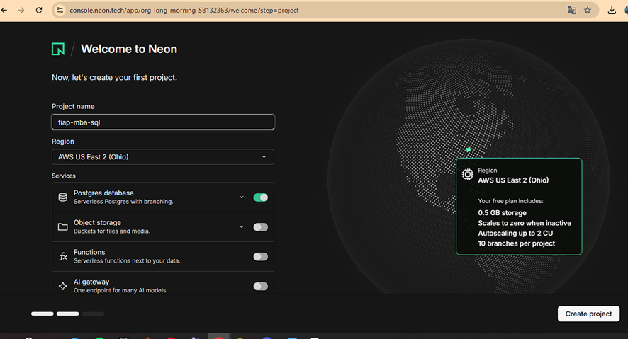

---

## 2. Estrutura das tabelas (scripts DDL)

Scripts utilizados para a criação das tabelas no PostgreSQL (também disponíveis em [`ddl.sql`](ddl.sql)):

```sql
-- 1. Criação da tabela ALUNO
CREATE TABLE aluno (
    id_aluno SERIAL PRIMARY KEY,
    nome_completo VARCHAR(100) NOT NULL,
    cpf VARCHAR(14) UNIQUE NOT NULL,
    data_nascimento DATE NOT NULL,
    email VARCHAR(100),
    telefone VARCHAR(15)
);

-- 2. Criação da tabela CURSO
CREATE TABLE curso (
    id_curso SERIAL PRIMARY KEY,
    nome_curso VARCHAR(100) NOT NULL,
    carga_horaria INT NOT NULL,
    nivel_escolaridade VARCHAR(50),
    valor_mensalidade DECIMAL(10,2) NOT NULL
);

-- 3. Criação da tabela TURMA
CREATE TABLE turma (
    id_turma SERIAL PRIMARY KEY,
    id_curso INT NOT NULL,
    ano_letivo INT NOT NULL,
    semestre INT NOT NULL,
    turno VARCHAR(20) NOT NULL,
    CONSTRAINT fk_turma_curso FOREIGN KEY (id_curso) REFERENCES curso(id_curso)
);

-- 4. Criação da tabela MATRICULA
CREATE TABLE matricula (
    id_matricula SERIAL PRIMARY KEY,
    id_aluno INT NOT NULL,
    id_turma INT NOT NULL,
    data_matricula DATE NOT NULL,
    status_matricula VARCHAR(20) NOT NULL,
    CONSTRAINT fk_matricula_aluno FOREIGN KEY (id_aluno) REFERENCES aluno(id_aluno),
    CONSTRAINT fk_matricula_turma FOREIGN KEY (id_turma) REFERENCES turma(id_turma)
);
```

### 2.1. Evidência das tabelas criadas

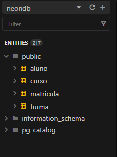

---

## 3. Método utilizado para popular as tabelas

A população das tabelas foi feita através do script [`popular_dados.py`](popular_dados.py), escrito em **Python 3.11**, usando as bibliotecas:

- **Faker** (`pt_BR`) — geração de dados fictícios com "cara" de dados brasileiros reais (nomes, CPF, telefone, e-mail, data de nascimento);
- **psycopg2** — driver de conexão com o PostgreSQL (banco hospedado no **Neon**).

### 3.1. Ordem de carga

As tabelas foram populadas respeitando a ordem de dependência das chaves estrangeiras:

1. `curso` → 2. `turma` (depende de `curso`) → 3. `aluno` → 4. `matricula` (depende de `aluno` e `turma`)

### 3.2. Volumes gerados

| Tabela | Registros | Observação |
|---|---|---|
| `curso` | 30 | lista pré-definida de nomes de cursos reais |
| `turma` | 90 | 3 turmas por curso (30 × 3) |
| `aluno` | 100.000 | nome, CPF, nascimento, e-mail e telefone fictícios via Faker |
| `matricula` | 1.000.000 | combinação aleatória de `id_aluno` × `id_turma` |

### 3.3. Estratégia de inserção (batch insert)

Ao invés de inserir linha a linha (o que seria inviável para 1 milhão de registros), o script insere em **lotes de 5.000 registros** por vez, usando `psycopg2.extras.execute_values`, que monta um único comando:

```sql
INSERT INTO matricula (id_aluno, id_turma, data_matricula, status_matricula)
VALUES (1, 2, '2024-03-01', 'Ativo'), (57, 14, '2023-08-12', 'Trancado'), ... -- até 5.000 tuplas
```

em vez de 5.000 comandos `INSERT` separados. Isso reduz drasticamente o número de round-trips entre o Python e o banco.

Outras otimizações aplicadas:

- **Commit por lote**, não por linha (`conn.autocommit = False` + `conn.commit()` a cada 5.000 registros);
- **Desativação temporária da checagem de FK/triggers** durante a carga em massa via `SET session_replication_role = 'replica'` (reativada ao final com `'origin'`), reduzindo o overhead de validação a cada insert;
- **CPFs únicos** controlados por um `set` em memória (`cpfs_usados`), evitando colisão com a constraint `UNIQUE` da tabela `aluno` sem precisar de tentativa-e-erro no banco.

### 3.4. Conexão

O script se conecta a um banco **PostgreSQL serverless (Neon)** através de uma connection string com SSL obrigatório (`sslmode=require&channel_binding=require`), definida na constante `DB_DSN`.

---

## 4. Evidências de execução


### 4.1. Saída do terminal durante a execução

<!-- Colar aqui o print/log do terminal mostrando o script rodando, ex:
cursos inseridos: 30
turmas inseridas: 90
alunos inseridos: 5000/100000
alunos inseridos: 10000/100000
...
matriculas inseridas: 1000000/1000000
Populacao concluida com sucesso.
-->

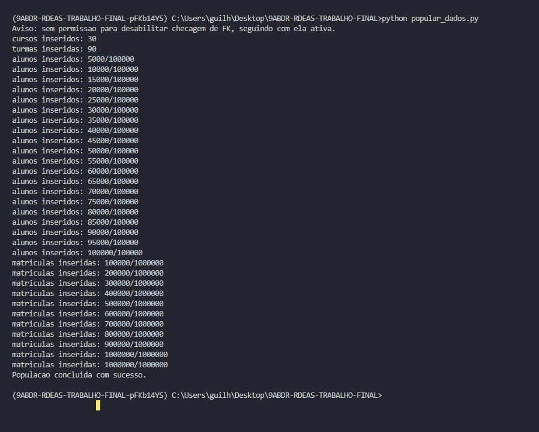

### 4.2. Confirmação dos volumes no banco

Após a execução, rodar no banco (via `psql`, DBeaver, etc.) e printar o resultado:

```sql
SELECT
  (SELECT COUNT(*) FROM curso)     AS total_curso,
  (SELECT COUNT(*) FROM turma)     AS total_turma,
  (SELECT COUNT(*) FROM aluno)     AS total_aluno,
  (SELECT COUNT(*) FROM matricula) AS total_matricula;
```

Resultado esperado: `curso=30`, `turma=90`, `aluno=100000`, `matricula=1000000`.

<!-- Colar aqui o print do resultado da query -->

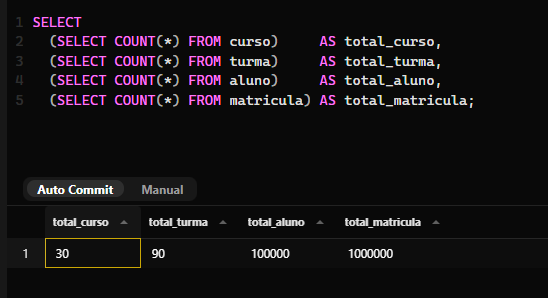

### 4.3. Tempo total de execução

<!-- Ex: "Carga completa em 18min32s" -->

Aproximadamente 15 minutos

## 5. Desafio (OPCIONAL)


### 5.1. Simular a edição concorrente de um registro;

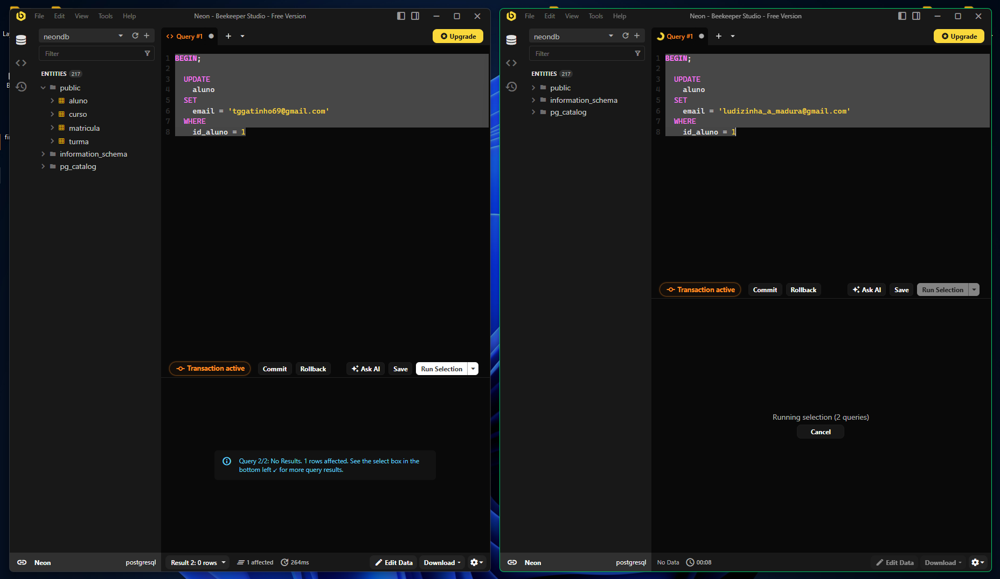

### 5.2. Forçar um dead-lock;

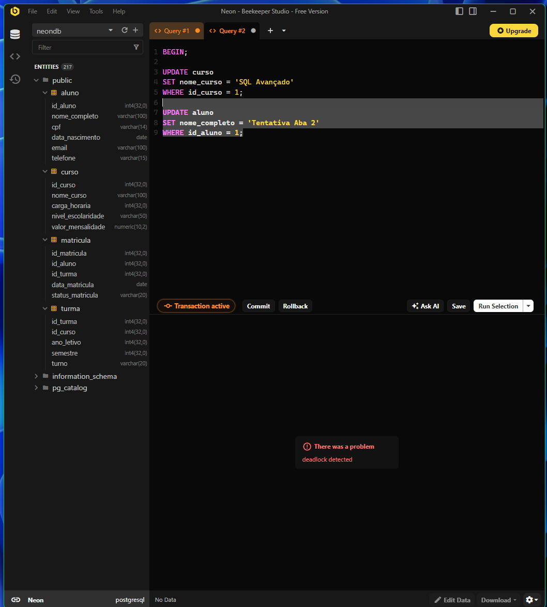

### 5.3. Forçar a leitura suja de um registro;

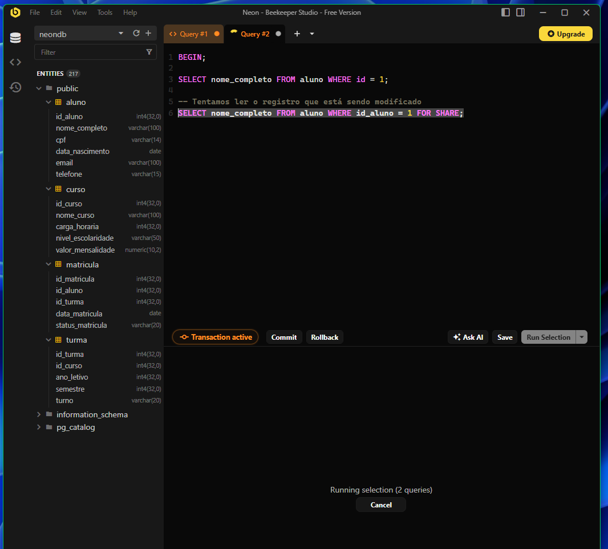

### 5.4. Forçar o banco de dados a perder a integridade (exemplo: criar um atributo not null para uma tabela existente).

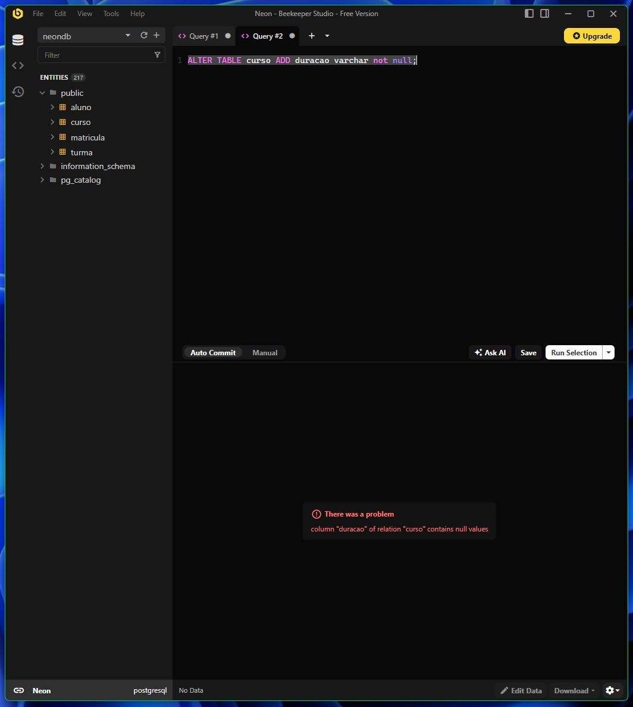

### 6. Trazer para a tabela transacional um atributo descritivo de uma das tabelas referenciadas.

(DDL):
```sql
ALTER TABLE matricula ADD COLUMN desc_turma VARCHAR(20);
```

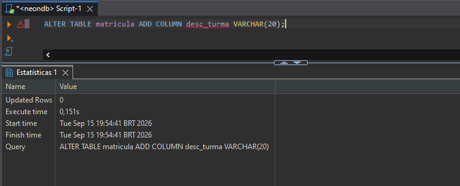

(DML)
```sql
UPDATE matricula m 
SET desc_turma = CONCAT(t.ano_letivo, '-', t.semestre, '-', SUBSTRING(t.turno, 1, 1)) 
FROM turma t 
WHERE m.id_turma = t.id_turma;
```
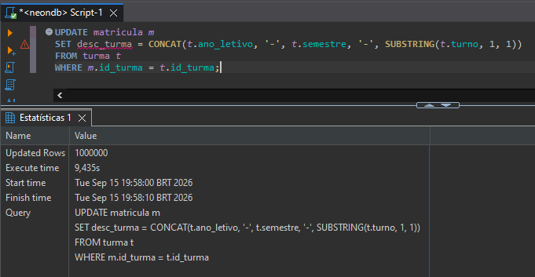

Printar os resultados:

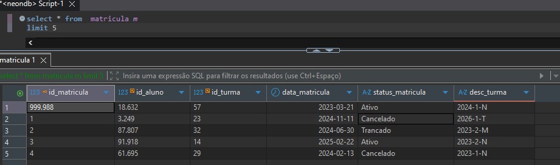

### 7. Tabela de histórico e expurgo

7.1 - Tabela transacional com sufixo "_history" e "_current"

7.2 - UPSERT da tabela original para as tabelas histórica e atuais